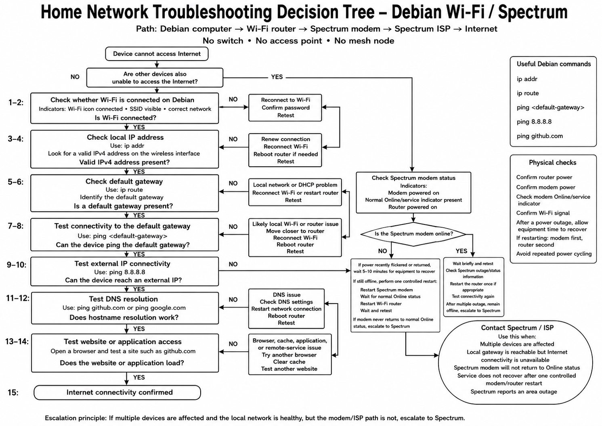
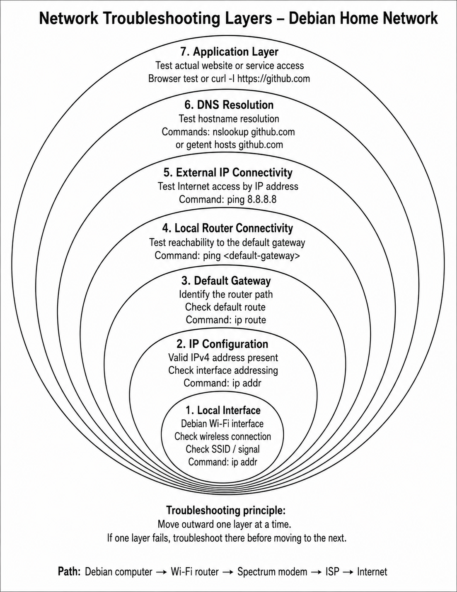
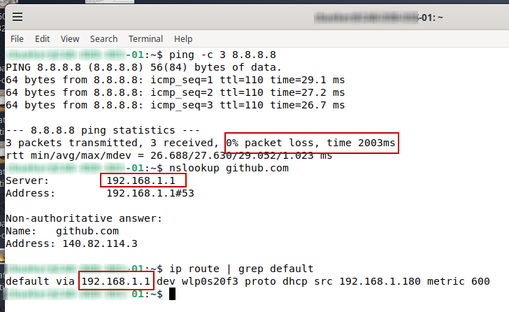
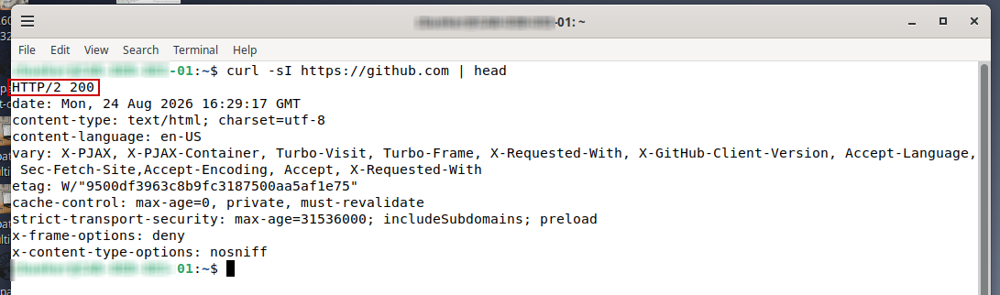

**Home Networking Troubleshooting Guide**

Structured Debian home-network troubleshooting using routing, DNS, ping, and HTTP validation.

In IT, formal and structured troubleshooting guides and methods help reduce guesswork and make the technical support that the IT team provides more efficient. Instead of randomly making changes here or there, each test should provide information that helps narrow the problem, isolate the issue, and determine the next course of action.

This project uses my home network to demonstrate that process. The troubleshooting guide I created begins with the local workstation and moves outward from there, starting with the wireless interface, then IP configuration, the default gateway, external connectivity, DNS resolution, and finally the application layer.

Having clear and accessible troubleshooting guides available to technicians helps create standardization and reduce friction during support work. When procedures are easy to follow, issues can be isolated much more quickly, handoffs become smoother, downtime is reduced, and IT can better support the efficiency and profitability of the business.

**Objectives**

- Create a repeatable process for troubleshooting network connectivity from the local workstation outward.
- Demonstrate how routing, external IP connectivity, DNS resolution, and application access can be validated at different levels and separately.
- Use a decision tree to clearly represent the troubleshooting schema and help identify where a problem is occurring before making changes.
- Recognize when an issue has moved beyond the local environment and needs to be escalated to the Internet service provider.
- Show how clear troubleshooting documentation and flowcharts can improve consistency, reduce unnecessary troubleshooting time, and support small businesses and other IT environments more effectively.

**Network Troubleshooting Decision Tree**

- Provides a systematic process for troubleshooting a network connectivity issue instead of making random changes.
- Starts with the local Debian workstation and moves outward through Wi-Fi, IP addressing, the default gateway, Internet connectivity, DNS, and application access.
- Uses each successful test to narrow the possible failure point before moving to the next layer.
- Separates a single-device problem from a broader router, modem, or ISP issue.
- Defines the point where local troubleshooting ends and escalation to the ISP becomes appropriate.

**Network Troubleshooting Layers**

- Organizes network troubleshooting as a series of layers moving outward from the local interface.
- Shows the relationship between IP configuration, the default gateway, router connectivity, external connectivity, DNS, and the application layer.
- Reinforces the principle of validating one layer before moving outward to the next.
- Provides a simple mental model that can be applied to larger business and enterprise network environments.

**Network Connectivity Validation**

- Verified external IP connectivity by successfully reaching 8.8.8.8 with no packet loss.
- Used DNS lookup to confirm that the hostname github.com successfully resolved to an IP address.
- Reviewed the default route to identify the local gateway used by the Debian workstation to reach networks outside the local subnet.
- These checks validate routing, external connectivity, and DNS resolution before moving to application-level troubleshooting.

**HTTP Application Validation**

- Used curl to test HTTPS connectivity to github.com from the Debian workstation.
- Received an HTTP/2 200 response, confirming that the remote web service successfully responded.
- Demonstrates the final application-level validation after routing, external connectivity, and DNS have already been confirmed.

**Lessons Learned**

- A formal and structured troubleshooting process in a particular business environment reduces guesswork by testing one layer at a time and using each result to inform the next action.
- A clear decision tree helps isolate issues more quickly and makes troubleshooting easier to follow, repeat, and hand off to another technician.
- Validating the default gateway, external connectivity, DNS, and application access separately helps identify where the breakpoint is and where the failure is actually occurring.
- Knowing the network topology and escalation boundaries helps avoid unnecessary changes, reduces friction, and makes it easier to involve the ISP when needed.
- Clear documentation improves the consistency of IT work, supports smoother handoffs, and helps reduce downtime and troubleshooting time.

This guide provides me with a structured and repeatable way to troubleshoot my home network instead of relying on trying one thing or another. It improves efficiency by making each troubleshooting step a formal, logical action that is easy to follow and connected to the next course of action.

Using this type of process helps me maintain my home network in a more organized and businesslike manner. It allows me to validate connectivity at different layers, identify breaks or issues more quickly, avoid unnecessary changes, and recognize when the problem is likely with the ISP.

Making sure a clear troubleshooting process is in place also helps support a more stable and secure IT environment because changes are made intentionally, documented clearly and cleanly, and based on evidence and data rather than opinions or assumptions.

Navigation

[`Back to GitHub Profile`](https://www.github.com/cbueker-it)

